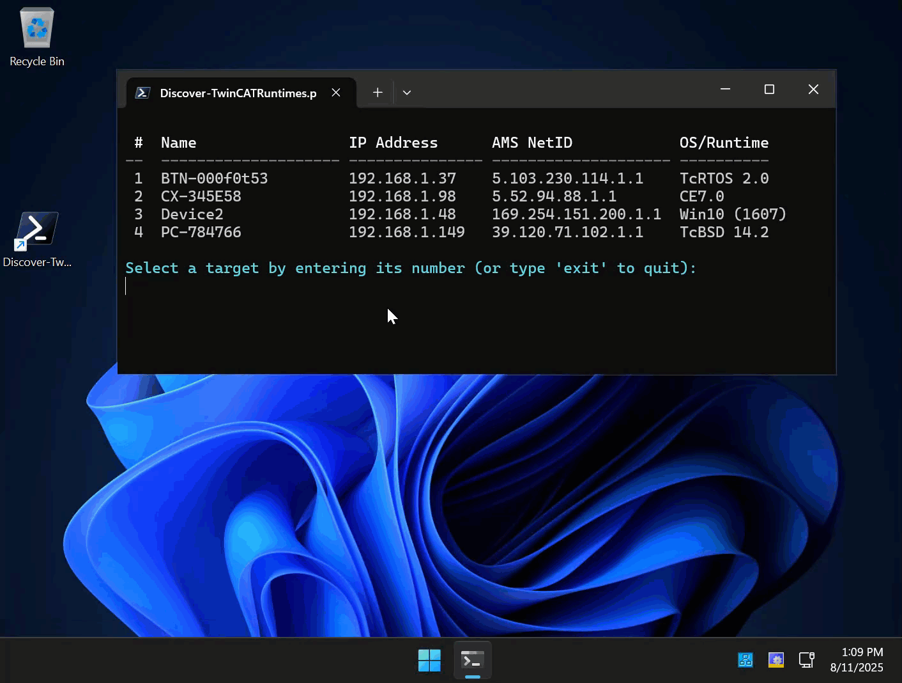

# TwinCAT Runtime Device Discovery & Connection Tool

A PowerShell script that automatically discovers TwinCAT runtime devices on your network via ADS broadcast search and provides direct OS-level connection options including SSH, RDP, WinSCP, and CERHost.



## Features

- **Automatic Runtime Discovery**: Uses ADS route discovery to find all TwinCAT runtime devices on the network
- **Multi-Platform Runtime Support**: Supports TwinCAT runtimes on Windows, TcBSD, TcRTOS, Linux, and Windows CE
- **Multiple OS Connection Methods**:
  - Web-based Device Manager access
  - SSH connections (Linux/TcBSD)
  - Remote Desktop Protocol (Windows)
  - CERHost for Windows CE devices
  - WinSCP file transfer (Linux/TcBSD)
- **Auto-Download CERHost**: Automatically downloads and installs CERHost.exe when needed
- **Real-time Updates**: Continuously monitors for new devices with automatic refresh
- **User-Friendly Interface**: Interactive console menu with timeout-based input

## Prerequisites

- **[Powershell 7](https://learn.microsoft.com/en-us/powershell/scripting/install/installing-powershell-on-windows?view=powershell-7.5)**
- **TcXaeMgmt PowerShell Module 6.2.0 or greater** (automatically installed if not present)
- **Network Access** to TwinCAT runtime devices
- **Optional Tools**:
  - WinSCP (for file transfers)
  - Windows built-in RDP client (mstsc.exe)

### Setting PowerShell 7 as Default for .ps1 Files

Since this script requires PowerShell 7, you may want to set it as the default application for opening .ps1 files:

**Using Windows Settings**
1. Right-click any `.ps1` file
2. Select "Open with" → "Choose another app"
3. Browse to PowerShell 7 location (typically `C:\Program Files\PowerShell\7\pwsh.exe`)
4. Check "Always use this app to open .ps1 files"
5. Click OK

## Installation

1. **Clone or Download** this repository
2. **Run the script** - dependencies will be installed automatically

```powershell
# Clone the repository
git clone <repository-url>
cd twincat-runtime-discovery

# Run the script
.\Discover-TwinCATRuntimes.ps1
```

## Usage

### Basic Usage

```powershell
.\Discover-TwinCATRuntimes.ps1
```

### Advanced Usage with Parameters

```powershell
.\Discover-TwinCATRuntimes.ps1 -TimeoutSeconds 15 -AdminUserName "admin" -AdminPassword (ConvertTo-SecureString "password" -AsPlainText -Force)
```

### Parameters

| Parameter | Type | Default | Description |
|-----------|------|---------|-------------|
| `TimeoutSeconds` | int | 10 | Timeout for user input in seconds |
| `WinSCPPath` | string | `C:\Program Files (x86)\WinSCP\WinSCP.exe` | Path to WinSCP executable |
| `CerHostPath` | string | `$PSScriptRoot\CERHOST.exe` | Path to CERHost executable |
| `AdminUserName` | string | `Administrator` | Default username for connections |
| `AdminPassword` | SecureString | `"1"` | Default password for connections |

## TwinCAT Runtime Support Matrix

| Runtime Platform | Device Manager | SSH | RDP | WinSCP | CERHost |
|------------------|:--------------:|:---:|:---:|:------:|:-------:|
| **Windows** | ✅ | ❌ | ✅ | ❌ | ❌ |
| **TcBSD** | ✅ | ✅ | ❌ | ✅ | ❌ |
| **TcRTOS** | ✅ | ❌ | ❌ | ❌ | ❌ |
| **Linux** | ✅ | ✅ | ❌ | ✅ | ❌ |
| **Windows CE** | ✅ | ❌ | ❌ | ❌ | ✅ |

## How It Works

1. **Module Check**: Verifies TcXaeMgmt PowerShell module (v6.2.0 or greater) is installed
2. **Runtime Discovery**: Uses `Get-AdsRoute -All` to discover TwinCAT runtime devices via ADS
3. **Monitoring**: Continuously scans for new runtime devices every 10 seconds (configurable)
4. **OS Connection Options**: Presents appropriate native OS connection methods based on runtime platform
5. **Auto-Setup**: Downloads required tools (like CERHost) automatically when needed

## Screenshots/Example Output

```
 #  Name                 IP Address      AMS NetID            OS/Runtime
--  -------------------- --------------- -------------------- ----------
 1  BTN-000f0t53         192.168.1.37    5.103.230.114.1.1    TcRTOS 2.0
 2  CX-345E58            192.168.1.98    5.52.94.88.1.1       CE7.0
 3  Device2              192.168.1.48    169.254.151.200.1.1  Win10 (1607)
 4  PC-784766            192.168.1.149   39.120.71.102.1.1    TcBSD 14.2

Select a target by entering its number (or type 'exit' to quit):
```

## Troubleshooting

### Common Issues

**No runtime devices found:**
- Ensure TwinCAT runtime devices are powered on and connected to network
- Check firewall settings (ADS discovery uses UDP port 48899/udp (also outgoing))

**CERHost connection fails:**
- Enable CERHost service on the Windows CE
- Check that port 987 is open

**SSH connection issues:**
- Confirm SSH service is running on target runtime device
- Check authentication credentials
- For Linux runtimes, HMAC-SHA2-512-ETM is used for compatibility

**Module installation fails:**
- Run PowerShell as Administrator
- Check internet connectivity for PowerShell Gallery access
- Manually install: `Install-Module TcXaeMgmt -Force`

### Debug Mode

Enable verbose output for troubleshooting:

```powershell
.\Discover-TwinCATRuntimes.ps1 -Verbose
```

## Security Considerations

- **Credentials**: Default password is "1" - change for production use
- **Network**: Script performs network scanning - ensure compliance with security policies
- **Permissions**: May require elevated privileges for some connection types
- **Auto-Download**: CERHost is downloaded from official Beckhoff servers


---

**Note**: This tool is designed for system administrators and automation engineers working with TwinCAT runtime systems. It provides direct OS-level access to runtime devices for maintenance, troubleshooting, and configuration tasks. Always follow your organization's security policies when using network discovery tools.

---
### Disclaimer:
All sample code provided by Beckhoff Automation LLC are for illustrative purposes only and are provided “as is” and without any warranties, express or implied. Actual implementations in applications will vary significantly. Beckhoff Automation LLC shall have no liability for, and does not waive any rights in relation to, any code samples that it provides or the use of such code samples for any purpose.
